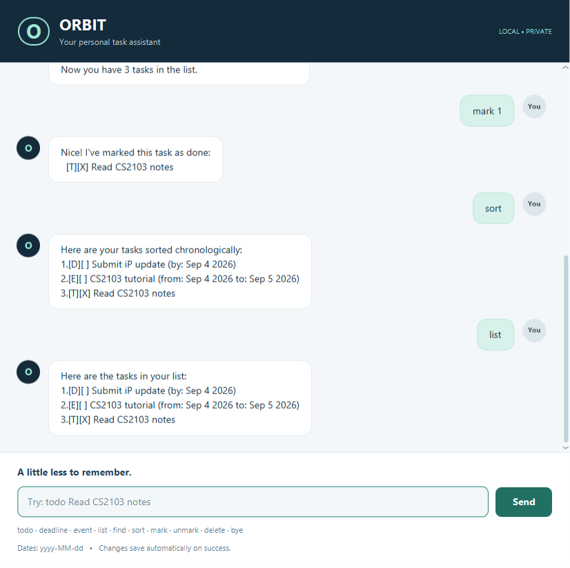

# Orbit User Guide

Orbit is a local task assistant for people who prefer fast keyboard commands. It keeps todos,
deadlines, and events together in a compact chat interface, saves every successful change
automatically, and keeps all data in the folder where it is launched.



## Quick start

1. Install Java 25.
2. Download `Orbit.jar` from the [latest release](https://github.com/chocoHacks33/ip/releases/latest).
3. Put the JAR in its own folder and run `java -jar Orbit.jar` from that folder.
4. Type a command and press **Enter**, or select **Send**.

Orbit creates `data/orbit.txt` beside the JAR. Keep that file if you move the app and want to keep
your tasks. Do not run two Orbit windows against the same data file at the same time.

## Command summary

| Action | Format | Example |
| --- | --- | --- |
| Add a todo | `todo DESCRIPTION` | `todo Read CS2103 notes` |
| Add a deadline | `deadline DESCRIPTION /by DATE` | `deadline Submit report /by 2026-09-25` |
| Add an event | `event DESCRIPTION /from START /to END` | `event Project meeting /from 2026-09-22 /to 2026-09-23` |
| Show every task | `list` | `list` |
| Mark a task done | `mark NUMBER` | `mark 2` |
| Mark a task not done | `unmark NUMBER` | `unmark 2` |
| Delete a task | `delete NUMBER` | `delete 2` |
| Find matching descriptions | `find KEYWORD` | `find project` |
| Sort tasks by date | `sort` | `sort` |
| Exit | `bye` | `bye` |

Commands and markers such as `/by`, `/from`, and `/to` are case-sensitive. Extra arguments are
rejected for commands that do not accept them, so a typing mistake cannot silently change a task.

## Adding tasks

### Todos

Use `todo DESCRIPTION` for a task without a date:

```text
todo Read CS2103 notes
```

### Deadlines

Use `deadline DESCRIPTION /by DATE` for work due on a date:

```text
deadline Submit report /by 2026-09-25
```

### Events

Use `event DESCRIPTION /from START /to END` for an activity spanning two dates:

```text
event Project meeting /from 2026-09-22 /to 2026-09-23
```

Every date must use `yyyy-MM-dd`, and an event's end date must be after its start date. Orbit
rejects impossible dates and invalid ranges with an orange warning message while leaving existing
tasks unchanged.

## Viewing and changing tasks

Run `list` to see the full numbered list. Use those numbers with `mark`, `unmark`, and `delete`.
Task numbers can change after a deletion or sort, so run `list` again when unsure.

```text
mark 2
unmark 2
delete 2
```

An out-of-range or non-numeric task number produces an error and does not modify the list.

## Finding tasks

Use `find KEYWORD` to search task descriptions. Search is case-sensitive and supports phrases:

```text
find project meeting
```

The numbers in search results are result positions only. Use the numbers from `list` before
marking, unmarking, or deleting a task.

## Sorting tasks

Run `sort` to arrange tasks chronologically. Deadlines use their due date and events use their
start date. Tasks on the same date keep their relative order; undated todos appear last. The new
order is saved and becomes the numbering used by later commands and future sessions.

## Saving, recovery, and exit

Orbit saves each successful change to `data/orbit.txt`. If the file is missing, Orbit creates a new
empty one. If the file cannot be read or contains invalid data, Orbit reports the problem instead
of crashing and opens with an empty in-memory list; keep a backup before replacing a damaged file.

Use `bye` to show the farewell and close Orbit. Closing the window is also safe because successful
changes are saved immediately.

## Acknowledgements

Orbit's launcher, custom dialog, and FXML/controller structure are adapted from the
[SE-EDU JavaFX tutorial](https://se-education.org/guides/tutorials/javaFx.html). The project uses
the [SE-EDU AddressBook-Level3 Checkstyle configuration](https://github.com/se-edu/addressbook-level3/tree/master/config/checkstyle).
